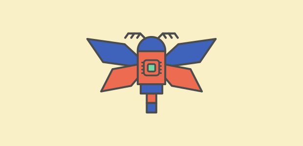

For a discipline supposedly rooted in rationality and logic, it's surprising there isn't a greater emphasis placed on decision-making. All too often, critical decisions are led by heuristics rather than formal methods.

===

### Background

Recently I'd been working on a software project that had made an idiosyncratic choice in terms of the domain language. It wasn't apparent to me why the choice had been made in favour of this language, since its suitability for the problem context seemed aberrant at best.

From an outsider's perspective, there were evidently more appropriate choices that could've been made in retrospect, so it perplexed me as to how this decision had been reached in the first place. It led me to consider the decision process that produced this sub-optimal outcome.

My intention isn't in admonishing poor design choices, but rather to better understand the factors that influence said choices. It goes without saying that fundamental decisions on language or architecture are critical to the overall success of a project.

Hence, it's equally important to recognise the merits of optimal decision-making. This naturally drew me into the study of cognitive bias and decision-making, and how I might learn to make more informed software decisions myself.

### Extinction by Instinct

The phrase captures a mode of failure where habitual reliance on instinct supplants deliberate analysis. My initial suspicions were formed by working with the language directly. The more I dove into the project, the better I understood its impracticality. That's not to say the language is intrinsically "flawed"; rather, it's ill-suited to the task at hand. The longer I spent hacking away, bending it to work, the more I felt I was trying to "fit a square peg into a round hole".

Likewise too, the better I understood the domain, the better I could reason why other programming languages were more widely popular in this context. Giving in to speculation, why had this esoteric choice been made?

The answer I learnt was plainly,

> _It's the language that's always been used_

At face value, this is a sensible decision. Everyone is competent in this language and every other internal project has been completed in this language too. What's more, the language is supported in this new domain so it should be easy to reuse familiar tools and patterns.

And indeed, things do work. Barely. Not optimally, but just well enough that the difficulty in doing so can be justified. Therein lies the difference between two styles of decision-making; satisficing vs maximising.

The choice of language was a satisficing decision, rooted in reaching a pragmatic solution that had the consensus of the team, rather than exerting effort in evaluating the wider unknowns of the problem domain to formulate an informed, if not idealised, decision.

### Prevalence of Heuristics in Software Development

This no-frills decision-making strategy evokes the mantra of _"move fast and break things"_.

In fact, by and large, the software industry revolves around this hypothesis. Agile sprints, rapid iteration, minimum viable products, etc. The jargon practically promotes satisficing with every sip of the kool-aid.

Paradoxically then, this mindset is grounded more so in intuition than reason or logic. So why the dichotomy?

I think this can be explained by our own innate dispositions. As with any decision, it's human behaviour to seek the most convenient conclusion by the principle of least effort (i.e. _"path of least resistance"_). Moreover, most decisions in day-to-day life are also inconsequential, hence it's only economical to lean on heuristics. However, in our routine, this can become habitual - sometimes to our detriment.

This is evidenced most acutely by the complex decisions that must be concluded in software design. In these circumstances, our rationality is, in fact, _bounded_. Our time, cognitive capacity and autonomy are limited. These constraints exert pressures on our ability to _maximise_ our decisions. It follows then, that we seek to compromise with a bias for our own utility.

Unfortunately, software doesn't forget, and it never forgives. A compromised start inevitably leads to a compromised end. Hence why perfect software doesn't exist; it's simply infeasible to develop perfect software based on pure rational decisions in the real world.

### Recognising Heuristics in Decision Processing

With that doom and gloom summarily described, is it worth simply conceding to heuristic-based decision processing?

I could never acquiesce to that approach. Anecdotally, it's always been my experience that software entropy begets software entropy. Sometimes dubbed "software rot" or, more benignly, "technical debt", in any case it only propagates decay. David Thomas, in his book, "The Pragmatic Programmer" applies the analogy of the [Broken Window Theory](https://en.wikipedia.org/wiki/Broken_windows_theory#:~:text=The%20broken%20windows%20theory%20is,and%20disorder%2C%20including%20serious%20crimes.) to illustrate the effects entropy can have on a project,

> _"Don't leave "broken windows" (bad designs, wrong decisions, or poor code) unrepaired. Fix each one as soon as it is discovered. If there is insufficient time to fix it properly, then board it up. Perhaps you can comment out the data instead. Take some action to prevent further damage and to show that you're on top of the situation"_

> _"We've seen clean, functional systems deteriorate pretty quickly once windows start breaking. There are other factors that can contribute to software rot [...] but neglect accelerates the rot faster than any other factor"_

> _"One broken window - a badly designed piece of code, a poor management decision that the team must live with for the duration of the project - is all it takes to start the decline"_

His advice is prescriptive: do not tolerate broken windows, and to highlight his words verbatim, _"bad designs"_ and _"wrong decisions"_. Whilst these are sound words, they don't afford any insight as to how to mitigate the likelihood of broken windows occurring from the outset.

This leaves us with an uncomfortable catch-22 of sorts. If it's indeed impossible to make utterly rational decisions, and heuristics are a crutch, how can we write good software?

First and foremost, the easiest means of minimising poor decisions is a self-awareness of our own cognitive biases. Biases aren't inherently "bad" but rather, they can lead us astray towards inferior outcomes. Returning to my opening remarks about the choice of programming language being maladaptive, it's obvious that there are biases at play.

The observation on the pervasive use of the language for every contingency strongly suggests an ingrained sense of "status quo bias". This "anchoring" around the language sustains a self-reinforcing feedback loop, that only affirms the established norm.

This central tenet engenders other adverse cognitive biases that only serve to augment the dominant thought, rather than negate it.

#### Information Cascade

An information cascade can explain the adoption of the familiar language over other (more optimal) alternatives. In simple terms, it occurs when we, as individuals, decide to select the _same_ choices as made by others prior. In lieu of our own independent decision, we instead place our favour in the inference of our peers' actions.

This desire for conformity can _cascade_ poor choices, as everyone jumps on the same bandwagon so to speak. This groupthink entrenches the decision, as the desire for consensus outweighs critical evaluation. Usually the outcome of which drifts towards a more moderate option. This in turn, is a manifestation of the _"Compromise Effect"_ where we assume the most middling choice carries the most benefit. In the case I observed, each new engineer adopted the established language because every predecessor had done the same. The choice perpetuated itself not through re-evaluation, but through imitation.

This evokes the adage,

> _"nobody ever got fired for buying IBM"_

#### Escalation of Commitment

With a compromised decision established, collective attention is placed squarely on the decided choice. Moreover, there's typically little scope afforded to deliberating information that doesn't bear relevance to this choice. In fact, this common-information bias can compound attempts to dislodge a prevailing norm, despite new evidence that might arise to contradict it.

Even in scenarios where the original choice is self-evidently unfavourable, its justification is founded upon the cumulative investment thus far accrued. Irrationally, even when its future detrimental cost outweighs its expected benefit.

This _"sunk cost"_ intransigence deters new ideas from being proposed, and unfortunately only encourages _"confirmation bias"_ in seeking to substantiate what is now perceived to be a tenuous decision.

#### Establishment of Convention

When the desire for group cohesiveness takes precedence, cognitive inertia to change can embed itself surreptitiously. From which a tendency in favour of _omission_ (inaction) over _commission_ (action) can take hold. This _"Omission Bias"_ as it's termed, again reinforces the collective norm.

With convention too comes a predisposition to favour familiarity as a heuristic, of which the _"Einstellung Effect"_ is perhaps the best illustration. It describes our inclination to solve a given problem in a familiar manner, despite more appropriate methods being available.

This succinctly portrays my observations on the misguided strategy of employing a familiar language, without critical evaluation of its appropriateness to the problem domain. Furthermore, its maladaptation to the given problem is exacerbated by _"functional fixedness"_; the inhibition to adjust the use of the language in a dissimilar context.

This cognitive bias is closely related to the _"Law of the Instrument"_ or _"Maslow's Hammer"_, which similarly describes the over-reliance on a familiar tool, despite its shortcomings. To quote Maslow himself,

> _"I suppose it is tempting, if the only tool you have is a hammer, to treat everything as if it were a nail."_

### Dissenting Opinion

In the face of these ingrained biases, it can be difficult to affect change, or even at the very least, voice an opinion contrary to the norm.

No matter how high up the totem pole, our autonomy in shifting an established belief is predicated on our ability to convince others. Without endorsement, ideas cannot establish, let alone flourish.

There is a fundamental asymmetry at work here. The incumbent choice need only exist to be defended; the alternative must be argued, demonstrated, and proven superior. The burden of proof falls entirely on the dissenter, whilst the status quo is shielded by the very biases outlined above.

Unfortunately, in proposing an idea in direct confrontation of an entrenched norm, there is little chance it will overcome inertia through argument alone, however advantageous it may be. In scenarios such as these, it can be demoralising when ideas don't find credence.

Rather than seeking approval through traditional consensus, oftentimes the more effective approach is the pragmatic one. In the words of Grace Hopper,

> _"It's easier to ask for forgiveness than it is to get permission"_

Going ahead and furtively building a prototype, a trojan horse of sorts, to demonstrate an idea is a more persuasive strategy than any amount of abstract argumentation. It shifts the conversation from _"should we consider alternatives?"_ to _"look at what this already does."_ This is especially effective if it ameliorates a common group inconvenience, directly appealing to the _"Principle of Least Effort"_. With any luck, a working demonstration can catalyse adoption and undermine faith in the norm.

The key is in the framing. Presenting an alternative not as an indictment of the established choice, but as an experiment or complement, reduces the defensiveness that confrontation provokes. People are more amenable to trying something new than they are to admitting something old was wrong.

### Conclusion

I hope this exploration has highlighted the role cognitive biases play in software decision-making. It's nigh impossible to eliminate them completely, much less to convince others to recognise them in the first place. However, with some awareness, it may be possible to assuage their impact.

Martin Fowler approaches a related argument in his article, [Is High Quality Software Worth the Cost?](https://martinfowler.com/articles/is-quality-worth-cost.html), where he argues for a greater emphasis on maintaining and enhancing internal software quality, despite the extra effort that may cause in the short-term. His reasoning is sound: whilst initial progress may be slighter, it profoundly reduces the cost of future change.

I agree with his sentiment, and would expand upon it. The quality of the software is downstream of the quality of the decisions that produced it.

> Producing quality decisions _produces_ quality software

That said, it's difficult not to feel a sense of fatalism. Business priorities, feature creep, and tight deadlines can quickly undo any sincere efforts towards this aim. The broken windows accumulate not because we lack the awareness to prevent them, but because the incentives seldom align with the discipline required to do so.

The language choice that prompted this exploration was never revisited. The biases I've described ensured its entrenchment long before I arrived, and no amount of argumentation was going to dislodge it. But awareness of _why_ a decision persists is not the same as acquiescence to it. The next foundational decision will at least be made with eyes open.
