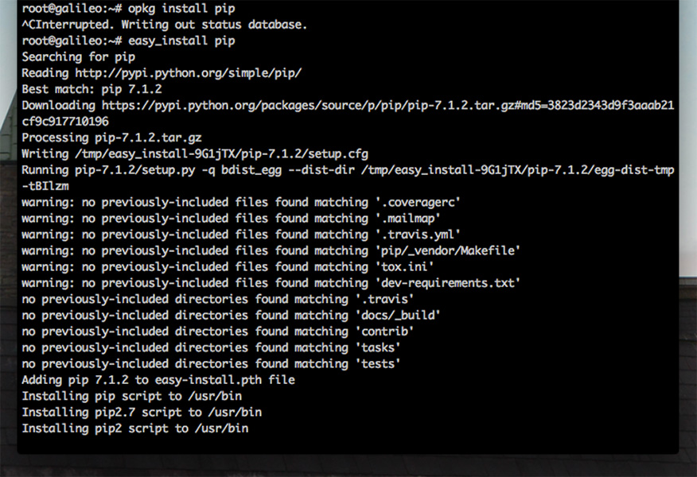
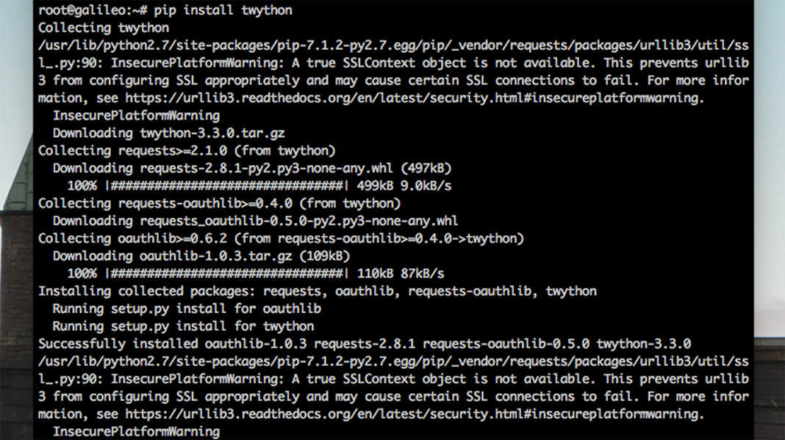
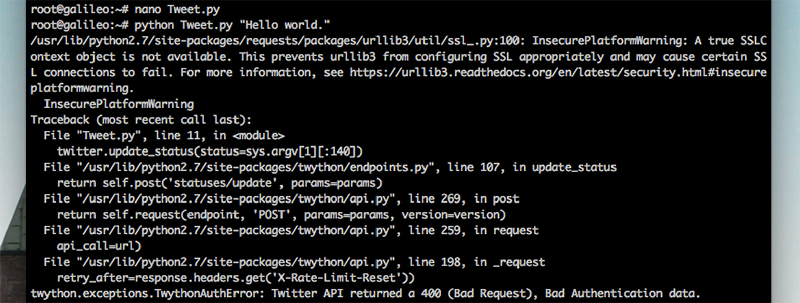
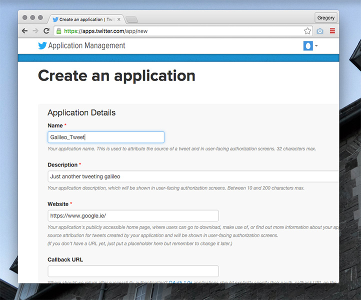
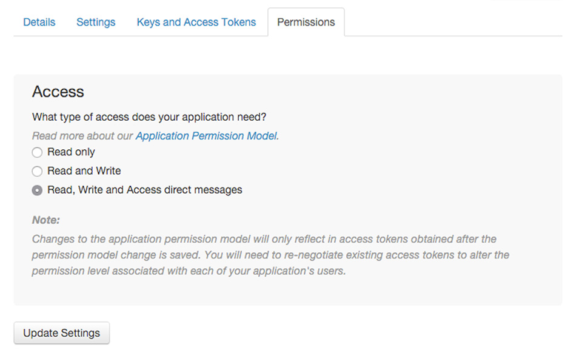

Since I've recently succeeded in getting my Galileo online, I've wasted no time in pressing it to its full potential as an IoT board. In this tutorial I'm recasting the Galileo as a Twitter-Bot to post my tweets to the world!


===

There's two common ways of doing this but for this example I'll explain the most straightforward method of having the Galileo post to Twitter by using the [Twython](https://twython.readthedocs.org/en/latest/) package. 

The other method is by having a script with some **cURL** onboard the Galileo that's invoked by a sketch.

###Step 1 - Authentication & Updating the clock

Firstly, assuming you have your Galileo connected to the internet by some means or another, you're ready to create your Twitter-Bot. 

You might have thought it'd be just a simple matter of opening the Arduino IDE and selecting the _TwitterClient_ example, but unfortunately you'd be mistaken.

Regrettably, Twitter now requires new authentication methods for verification. Methods based upon Twitter's old API 1.0 no longer work. 

The new verification method is called **OAuth** and can be a bit of a pain to work with. It requires token and secret token codes encoded in base64. Furthermore, your device (or Galileo in our case) must be able to provide timestamps in sync with the current real world time (independent of time-zones/daylight savings time).

If this is giving you a headache, don't worry - that's why we're using Twython! 

Twython is a very popular Python library that interfaces with the Twitter API - allowing you to interact with Twitter in a variety of ways such as searching, fetching trends and of course, tweeting. 

Before we get started we need to persist the hardware clock onboard the Galileo to avoid any SSL certification errors when we go to install. 

Sounds odd since all we want to do is post to Twitter, but it's an important step we need to take. 

Remember when I mentioned that Twitter's new verification method requires a timestamp? Well, it's necessary for authorisation.

Twitter requires that every device have a valid date and time, in sync with the rest of the world. To view the system time in UTC maintained by the kernel software, just type:

`date`

Now to check the hardware clock, type in:

`hwclock`

Trying to get the timestamp based upon one of these dates will throw an error, since Twitter won't authorise them as they're not synchronised with real time. 

Synchronise the hardware clock by typing:

`hwclock -w`

Check it again and things should be back in sync. This is enough to continue on with the project but be aware that the time won't persist if your system reboots for some reason. 


The clock will be reset on start-up and you'll need to re-issue the command. 

The usual way of persisting the clock is by using a 3V coin cell battery. Unfortunately I didn't have one so I chose to make one instead!

I connected two 1.5V in series and taped them together with wires attached at both ends. Checking with a multimeter I had 3V - exactly the same as using a coin battery; without much extra hassle.

###Step 2 - Installing Packages

Before we can install Twython we'll need to make some downloads:

| Download | Description |
| ------:| -----------:|
| SetupTools | For easier download, build, install, upgrade etc. of Python packages |
| Pip | For installing Python packages |
| Twython | Python wrapper for Twitter's API |
| Nano | A text editor for writing our Python script |

Firstly, to install **Nano**, type the following into the terminal:

`opkg install nano` 


Once that's finished install **SetupTools** by typing:

`opkg install python-setuptools`

Next install **Pip** by typing:

`easy_install pip`



Finally, using pip install **Twython**:

`pip install twython`



If you've keen eyes, you might notice in the image above that there's a warning contained in the installation:

> /usr/lib/python2.7/site-packages/pip-7.1.2-py2.7.egg/pip/_vendor/requests/packages/urllib3/util/ssl_.py:90: InsecurePlatformWarning: A true SSLContext object is not available. This prevents urllib3 from configuring SSL appropriately and may cause certain SSL connections to fail. For more information, see https://urllib3.readthedocs.org/en/latest/security.html#insecureplatformwarning.

Without solving this issue, when you go to tweet later you'll likely encounter an error like the one below where Twython returns a 400 (Bad Request), Bad authentication data error.



While **urllib3** uses the library’s stock SSL module, there are several limitations which must be addressed by installing additional security; namely **PyOpenSSL**. 

Do so using Pip, by typing:

`pip install 'requests[security]'`

This installs the extra packages:

|  |  |
| ------| -----------|
|  | pyOpenSSL |
|  | ndg-httpsclient |
|  | Python wrapper for Twitter's API |
|  | pyasn1 |

With that done, you shouldn't get any authentication errors when you try to tweet later.

###Step 3 - Creating the Twitter App

Now that we're up to date on things, it's time to create our online Twitter application. In order to do so, you must first have an account with Twitter.

Before you start, go into settings and make sure you've confirmed your email address and added your phone to your account. This is a necessary part when you want to develop for Twitter.

Next head [here](https://apps.twitter.com/app/new) to create your app. Enter a name, description, website (anything will do) and leave the _callback URL_ field blank. 



Once you're in, you'll see the overview page for your application showing all the data you entered. The page also includes your unique **OAuth** settings data such as the Consumer API key and Access tokens.

Click on the _Permissions_ tab to change the access level of the application. Change it to **read, write and access direct messages**.



Next click the _Key and Access Tokens_ tab. Click on the **Create my access token** button to generate your tokens.

! Note that you'll likely need to refresh your page in between changing settings to ensure you have the latest modifications applied.

With everything done you should have four pieces of information:

|  |  |
| ------| -----------|
|  | Consumer Key (API key) |
|  | Consumer Secret (API Secret) |
|  | Access Token |
|  | Access Token Secret |

We'll need these in our python script for Twitter authentication.

###Step 4 - Writing the Python Script

Inside the Galileo navigate to:

`/home/root/`

Inside there, create a python file using Nano called "Tweet" by typing in:

`nano Tweet.py`

When Nano opens, paste the following code inside:

```python
import sys
import ssl
from twython import Twython

CONSUMER_KEY = '<YOUR CONSUMER_KEY>'
CONSUMER_SECRET = '<YOUR CONSUMER_SECRET>'
ACCESS_KEY = '<YOUR ACCESS_KEY>'
ACCESS_SECRET = '<YOUR ACCESS_SECRET>'

twitter = Twython(CONSUMER_KEY,CONSUMER_SECRET,ACCESS_KEY,ACCESS_SECRET) 

twitter.update_status(status=sys.argv[1][:140])
```

Substitute your own values for the Consumer and Access key fields. Save and close the file.

You can execute the python script by typing something like this for example:

`python Tweet.py "Hello from the Galileo!"`

All going to plan, check your twitter and you should get something like what I have below:

<div>
	<blockquote class="twitter-tweet" lang="en"><p lang="en" dir="ltr">Hello from the Galileo!</p>&mdash; Gregory Kelleher (@KelleherGregory) <a href="https://twitter.com/KelleherGregory/status/673537141834579968">December 6, 2015</a></blockquote>
	<script async src="//platform.twitter.com/widgets.js" charset="utf-8"></script>
</div>


