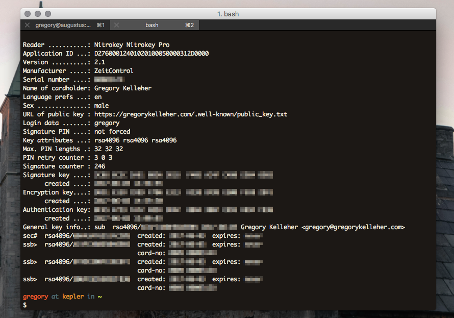
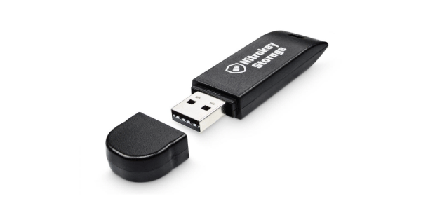
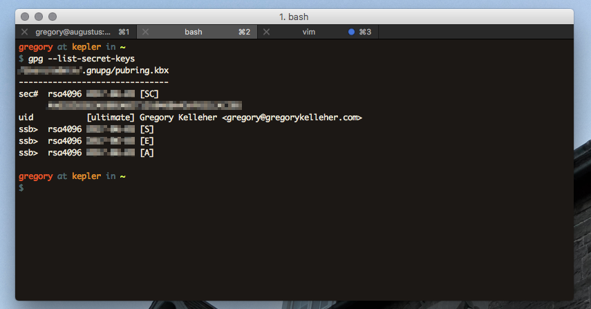
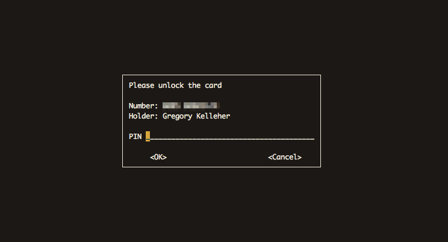
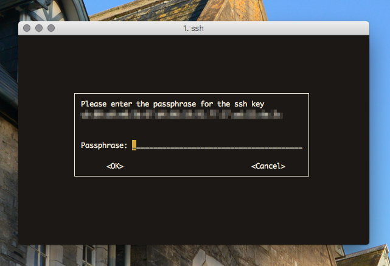
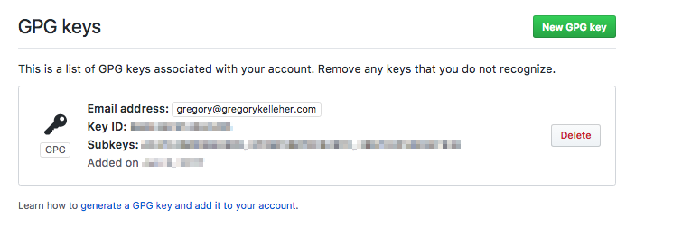
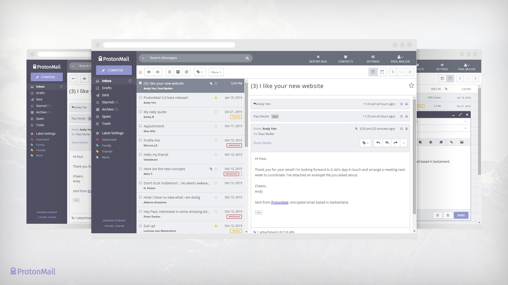
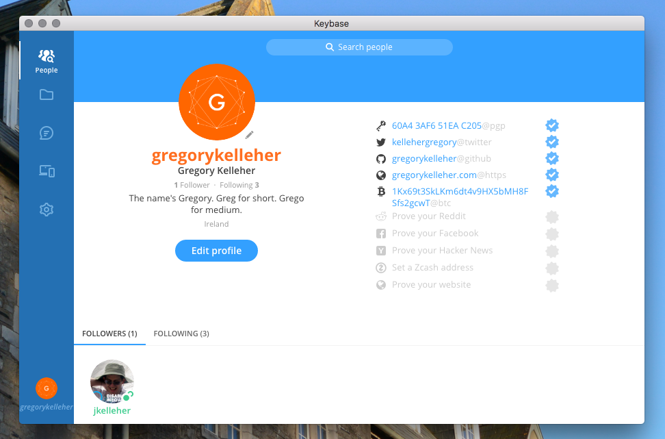
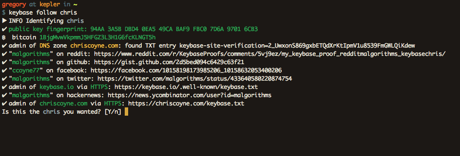

Given my newfound interest in Computer Security, I took to scrutinising my own habits and explored ways in which I could improve upon my own everyday practices. Pretty Good Privacy or PGP is one such outcome that came from my findings.

===

PGP is an old, if not venerable piece of software dating back to the early 90’s. Renowned for its longevity and esoteric subculture, PGP has withstood the test of time and still remains relevant today. PGP provides the means to fulfil the four fundamental tenets of Information Security: 

* Authentication
* Integrity
* Confidentiality
* Non-Repudiation

These principles derive from the well-known CIA Triad of Confidentiality, Integrity and Availability. Not to be confused with the Central Intelligence Agency, CIA. Yet from my own reading, I've found the previous four principles to be more prevalent. 

But before diving into PGP, it's wise to pause and consider the desired end goal. Summed up in a word, it's privacy. Pretty Good Privacy in fact. Hence the name. 

Understanding the key concepts below is critical in realising how privacy is achieved.

### Authentication

Easiest one first. You need to trust that you’re communicating with Alice. Or else any data received has little validity and could come from someone you don't trust, say for example, Eve. 

So the identity of the recipient and sender must be established before communications. Authentication is the verification of that identity; acquired by providing the correct credentials.

It goes without saying that having strong authentication is vital to ensuring privacy. Most of my use cases for PGP centre on the multi-factor authentication that it affords me. Multi-factor meaning that I need to provide more authentication information to verify myself.

!!! Common Multi-factor authentication terms include 2FA (Two-Factor Authentication) or U2F (Universal 2nd-Factor Authentication)

In straightforward terms, multi-factor authentication information usually consists of the following:

* Something you know, e.g. PIN, password, security question
* Something you have, e.g. credit card, USB security key
* Something you are, e.g. fingerprint, iris scan

Of course, it's easy to spot that some of the above are more secure than others. The ideal scenario would surely be to have a combination of all three.

Ideal, yes. Practical? Not quite. The crux of cryptography is convenience. Cryptography is intrinsically difficult and can add significant complexity. This in turn, often goes against the grain of usability.

In reality, most users opt for convenience. Instead choosing to askew well-intentioned authentication measures for short-term ease. This sacrifice in security has long-term repercussions since authentication has been diminished. 

It's beneficial to keep this concept in mind. Cryptography is only as good as it is convenient. As a point of fact, it's one of PGP's oft-cited failings. But more on that later.

### Integrity

After successful authentication, it's vital that the data wasn't interfered with during transmission.

This is the definition of integrity. But integrity is also much more than that. It's the continuation of data consistency, accuracy and trustworthiness.

So not only must the data not be altered in transit, but the inviolability of said data must be ensured against unauthorised persons. Otherwise, a breach in confidentiality may incur a concomitant corruption in data integrity.

### Confidentiality

When people give a definition for privacy, they’re thinking confidentiality. The idea that data is not available to unauthorised persons without authentication. Whether the data is sensitive or not isn't the issue. All data should be ensured confidentiality and treated in the same non-discriminatory manner.

On that point, it's wise to bring up the matter of semantics and the issue of privacy being conflated with secrecy.

The intertwined relationship of the two is difficult to separate. In simple terms, the definition of secrecy is what we know onto ourselves. Privacy enables us to keep what's secret, secret.

The two are not synonymous but are aligned. The subtle distinction or overlap between the two lends the popular phrase:

> “when I withhold information, it's privacy; when you withhold information, it's secrecy”.

In Information Security, confidentiality is the preferred term for privacy in this context. Confidentiality recognises that all information has value and is non-discriminatory. Whether it's credit card numbers or birthday wish-lists, it's all data in the pipe.

Everyone has information that they wish to remain undisclosed. They have a right to that fact and protecting it is the aim of confidentiality.

Confidentiality in the context of cryptography is achieved through encryption. In truth, it's the essence of cryptography. When information is confidential, it's indecipherable to anyone other than the recipient.

### Non-Repudiation

Non-repudiation is the guarantee that neither the sender or receiver can disclaim that data has been sent or received upon a successful transaction.

This concept is important for the internet, especially in financial or e-commerce applications. Non-repudiation is essential in ensuring the user has made a valid transaction request. It also guarantees that the user can't refute their actions in the future.

Non-repudiation is usually achieved by using a digital signature that's tied to a unique user. This ensures that the data (e.g. financial statement, contract, email) has been electronically signed by the purported user.

Like the section on authentication, a digital signature alone isn't always secure. Multi-factor methods of gathering user authentication information may be necessary. This of course, has the effect of making repudiation more difficult.

### Pretty Good Privacy

And finally, we've arrived at PGP. Outlining the key concepts above gives an indication of what PGP is designed to do. PGP is privacy for the internet. Authentication, Confidentiality, Integrity and Non-repudiation condensed into a single software package. It's a neat idea but I'm aware that it's something that also scores quite high on the nerdiness barometer.

The history of PGP began in the early 1990's with Phil Zimmermann, who created the first version of PGP as an open-source encryption program. The early history of PGP is an important one in the history of modern cryptography and I recommend reading about the early [Crypto Wars](https://en.wikipedia.org/wiki/Crypto_Wars) to learn more.

The most common open-source offering for PGP today is [GNU Privacy Guard](https://gnupg.org/) (GnuPG or GPG) as part of the GNU Project. GnuPG exists as a software suite that provides PGP functionalities.

So what is GnuPG anyways? It's easiest to think of GnuPG as being a key manager that provides a special key-chain. This key-chain in turn provides encryption/decryption, digital signatures and authentication using PGP.

The very first thing to do is generate the two most important keys, the Public and Private key-pair. Every PGP functionality hinges on these two distinct keys. Any sub-keys will also be generated from this key-pair.

If this sounds familiar, yes, this is Public Key Cryptography. Sometimes known as Asymmetric Cryptography. If it doesn't, you've been introduced to a fundamental cryptographic system that is the backbone of the modern internet.

Every transaction or secure connection online using today's internet standards is underpinned by Public Key Cryptography. The perfect example is the Transport Security Layer (TLS) that I frequently mention in my blog. Not forgetting to mention Bitcoin, SSH or Off-the-Record messaging (OTR) too.

It helps to have a good understanding of Public Key Cryptography before delving into PGP. Hence I recommend giving it a read, even for the sake of intellectual curiosity.

Since this isn't a post on Public Key Cryptography, I'm moving on and assuming a basic understanding of the concept.

After using GnuPG to generate the public and private key-pair, the two keys are used in unison to encrypt/decrypt, authenticate, digitally sign .etc.

For instance, someone using GnuPG could encrypt something using your public key. The only person able to decrypt is you, since you own the corresponding private key. Hence GnuPG is a secure means of protecting the contents of emails, files and documents.

The public key, as it's so named, is meant to be freely shared. This is done through placing the key on a special global directory of public keys called a key server. For instance, mine can be found [here](https://pgp.mit.edu/pks/lookup?op=vindex&search=0x60A43AF651EAC205). I've also placed mine on my website at this [address](https://gregorykelleher.com/.well-known/public_key.txt).

!!!! Since GnuPG public keys are long, a key can be shortened to a fingerprint for convenience. For instance, my public key fingerprint is `AA62 8265 62AE 005A 0271 D104 60A4 3AF6 51EA C205`

I discuss the purpose behind Keybase a little later, but my public key can also be found [there](https://keybase.io/gregorykelleher) too.

The private key must be kept ultimately secure. Whereas the public key allows others to encrypt data to you, the private key is used to decrypt that data. Anyone with access to your private key can steal your identity and decrypt your data.

So how do you secure your private key? It helps to be a little paranoid here. Typically, the user would generate their key-chain on their laptop and leave it at that. Unless the private key is protected with a pass-phrase, it's sitting on the laptop in the clear.

So protecting your key-chain is tied to how well you protect your laptop. For example, if your laptop were stolen by someone ‘tech-savvy’ enough, the thief would have full access to your GnuPG key-chain. They could steal your identity, impersonate and decrypt anything past or present. Essentially it's the coup de grâce for your key-chain.

The answer to this obstacle is not having your private key on your laptop at all. GnuPG allows you to create sub-keys, special keys derived from your master key. It mitigates some of the risk but won't prevent someone from decrypting your data if they have the right sub-key.

Sub-keys are bound to the master key but are independent to it. The neat feature of sub-keys is the fact they can be revoked without affecting the master key-pair.

!!! By default, GnuPG uses a primary signing key as the master key. This key is the public key and it's used for identity. It also generates an encryption sub-key automatically. This encryption sub-key is the private half of what's referred to as the Master Key-pair.

The master key verifies ownership of your key-chain. It can also be used to add/remove sub-keys as well as sign and certify others’ keys. And then the encryption sub-key is used to receive encrypted data.

!!! In my case, I selected `RSA (sign only)` to generate the master key instead, without the encryption sub-key.

From the original master key, I generated three sub-keys for signing, encryption and authentication respectively. These sub-keys are, in turn, associated with the master key (the primary signing key).

This newly generated key-chain (comprising of the master key and the new signing, encryption and authentication sub-keys) must be kept safe and offline. Losing this means everything. It's vital that it remains protected. In my case, I've chosen to export the master key-pair to a USB stick that I've encrypted with [VeraCrypt](https://www.veracrypt.fr/en/Home.html). I goes without saying that you should create backups too.

The next step most would take would be to discard the master key from their laptop. This leaves you with only the new signing, encryption and authentication sub-keys. This ‘handicapped’ key-chain is often referred to as a laptop key-chain.

I also decided to create a revocation certificate for my keys in case they were ever lost or compromised. It's worth taking the extra step of printing the revocation certificate out too.

!! Note that revoking a key won't necessarily mean that it's ‘disabled’. For instance, if your encryption sub-key was stolen, the attacker could still decrypt your data despite the key being revoked. Revocation only indicates to other PGP users that the key is no longer in use and shouldn't be trusted.

Having a ‘laptop key-chain’ has its own security vulnerabilities too. A stolen laptop means a stolen key-chain. And a pass-phrase isn't always enough to safeguard it either.

For this exact reason, I bought a [NitroKey](https://www.nitrokey.com/) that would securely contain my sub-keys instead. A NitroKey looks identical to a USB key and is designed to store and protect your keys. 

The best way to think of a NitroKey is to think of it like a security token. It's a physical security device that offers hardware-based protection. In essence, it's a 21st century key for accessing an electronically restricted resource.

It's not an old concept, but one that's gradually becoming more popular with the growth of Bitcoin. For all cryptocurrencies, rising valuations have triggered an increased demand for better protection. Hardware-based keys are the solution for safeguarding lucrative wallets.

Altogether, a NitroKey is a useful gadget that takes security to the next level. Its best feature is the fact that all PGP operations (signing, encryption, authentication) can be carried out on the NitroKey itself. Hence your keys will never be exposed to the computer you’re connected to. On account of that, you needn't worry about using your GnuPG keys on a potentially compromised third-party computer.

A NitroKey is a much safer means of carrying around your keys too. For instance, it could fit on your key-chain (no, the physical kind) alongside your car and house keys. It's also tamper-proof and pin protected.

!!! I chose NitroKey over the more popular YubiKey for the fact that the former was Open-Source. Proprietary software can never be trusted to be secure if it can't be independently audited and evaluable by the community. NitroKey is excellent in this regard as it's open-sourced all its schematics and firmware. I also feel it's best to support this practice whenever I can.

The NitroKey I purchased was the [NitroKey Pro](https://shop.nitrokey.com/shop/product/nitrokey-pro-3). It's the flagship model and also the one I'd recommend most. Besides storing your GnuPG keys, it can also generate one-time-passwords (HOTP and TOTP) for secure logins. These OTP codes are compatible with Google, DigitalOcean, Amazon and other online services. It also has a small password manager built in for your most important passwords too.

The NitroKey is treated as a smart-card by GnuPG. After inserting the USB key, the command, `gpg2 --card-status` reveals the configuration of the NitroKey. Likewise, `gpg2 --card-edit` enables you to change the parameters and personalise the NitroKey itself.

One of the first things to do is to change the Admin and User pins on the NitroKey. The User pin is for everyday applications, such as encryption, card unlocking and signing. The Admin pin is used less often, only in circumstances when you’re making modifications to the NitroKey.

!! The default User pin is "123456" and the default Admin pin is: "12345678". Be warned though, three failed attempts at the User pin will result in the NitroKey locking itself. The Admin pin can override this but be warned, three failed attempts at the Admin pin causes the NitroKey to destroy itself irreparably. 

The pin setup for the NitroKey can be done over the command line with GnuPG using ` gpg --change-pin` or else with NitroKey's software. 

To change Administrator configurations for the NitroKey, enter edit mode with  `gpg --card-edit` and at the `gpg/card>` prompt, type `admin` to access these settings.

After changing the pins and card settings, I transferred my sub-keys from my computer to the NitroKey. It's important to note that this is a one way operation so again, backups are vital.

Transfer is done using the `keytocard` command. GnuPG will give you a key slot option for storage. I did this for each of my keys in turn. At this point, no keys should remain on your computer. All the secret sub-keys `ssb` will be fully transferred to the NitroKey.

All being correct and with backups in place, the secret master key `sec` can now be removed safely with the GnuPG command, `gpg2 --delete-secret-keys $KEYID`.

Phew, now's the time to test whether everything went accordingly.

Removing and inserting the NitroKey again, verify that the secret keys are present with GnuPG using `gpg2 --list-secret-keys`.

!!!! Note that a `#` symbol next to `sec` means that the key doesn't exist on the device, and similarly, a `>` symbol next to `ssb` indicates that the key is a stub-key, located on the NitroKey.

What's been accomplished then? To recap, the `sec#` above next to the secret master key ID indicates that the key is not present on the computer. Like I mentioned, it's been backed up to an encrypted USB drive and hidden away. And lastly, the `ssb>` next to each sub-key reveals that they’re only stubs and are actually present on the NitroKey.

That's about it for setting up GnuPG on NitroKey. Whenever a PGP operation such as encryption, authentication or signing needs to be done, GnuPG will prompt for a smart-card insertion with the corresponding ID. In the next section I discuss more on how I use my NitroKey day to day.

### Use Cases for GnuPG

GnuPG has improved my own security to a large degree. I use it frequent enough that it was worth the initial effort of setup too. Although I rarely use GnuPG for secure communications because others don't use GnuPG.

I’ll elaborate on that later but it's one of PGP's often-mentioned faults. Despite that fact, I've examples below of how I use each of my sub-keys for everyday tasks.

### Password Manager - Encryption/Decryption

These days, most people are at least familiar with the idea of password managers. Two common examples are [LastPass](https://www.lastpass.com/) or [1Password](https://1password.com/). Remember one master password and you have access to your vault. I was using LastPass before GnuPG actually.

However, I was never confident in whether their main selling point was really the ‘convenience’ or the ‘security’ of having an online password manager. 

These services are better for storing passwords than stickie notes sure, but it's also vital to enable the additional security features that they provide such as password generation, two-factor authentication .etc. to ensure full security. In spite of that, many of these said features are premium only and you end up paying for your
security.

Online password managers are adequate if used intelligently and to their full potential like I described. Although they pose their own inherent risks too. 

Firstly, the fact that you’re placing your full trust in a company to hold all the keys to your digital life. Not only Google and Facebook accounts, but possibly bank account details or personal documents.

Provided you trust the company, you’re pooling your most critical data with everyone else on their server. It's an obvious target and any successful breach would prove catastrophic.

!! For instance, LastPass was [hacked](https://www.wired.com/2015/06/hack-brief-password-manager-lastpass-got-breached-hard/) in 2015. Email addresses, password hints, and encrypted master passwords were exposed. More recently, a [vulnerability](https://www.theguardian.com/technology/2016/jan/18/phishing-attack-steal-lastpass-password-manager-details) in the login page of their app that made phishing attacks possible was discovered.

It was reading the news surrounding LastPass that prompted me to switch to GnuPG. Behind the scenes, everyone's using public-key and symmetric cryptography anyways. So why not be responsible for your own security?

Currently I'm using a CLI password manager called [Pass](https://www.passwordstore.org/) on my local machine. Data is encrypted using my GnuPG encryption sub-key and stored using Pass in a special directory named `~/.password-store`. Since my sub-keys exist only on my NitroKey, decryption requires its physical presence.
 
Another neat feature to Pass is the ability of Git integration. This is especially useful in tracking changes and maintaining backups. 

!! This isn't an invitation to push your encrypted Pass directory to Github as a public repository! One downside to Pass is how it shows hierarchical directory listings in the clear. 
!! 
!! This has the consequence of revealing the ‘metadata’ behind entries. It's not a security flaw per say, but it'd be an improvement if entry names could be hidden from view.

That's all there is to Pass. It's fundamentally simple and it's the most common use I have for GnuPG. I've found it to be incredibly useful and I'd recommend it. There's also quite a few extensions for Pass too, such as add-on OTP support.

### SSH - Authentication

The second typical use I have for PGP is SSH server authentication. My server is hosted on DigitalOcean and I use SSH to login. With GnuPG, I can use the authentication key I've present on my NitroKey for SSH connections.

GnuPG allows you to extract an SSH public key from your key-chain and export it to your server. Then I overrode the default SSH Agent on Mac with the GnuPG Agent daemon for SSH connections. 

In a nutshell, this means that the only method for anyone to log into my remote server is by physically having my NitroKey.

!!! Setting up the GnuPG Agent is a little tricky. The newest version of GnuPG, GPG 2.1 is also slightly different. [This](https://incenp.org/notes/2015/gnupg-for-ssh-authentication.html) is a tutorial for the latest version of GnuPG.

It's pretty neat and it's also a bonus that DigitalOcean supports OTP for the NitroKey.

### Github - Signature

I don't contribute much on Github but often it's important that commits are validated and contributors identifiable.

Sounds like the perfect use-case for PGP and the signing sub-key. Remember that digital signatures fall under the tenet of Non-Repudiation in Information Security. Being able to digitally sign a Git commit, merge .etc. uniquely affiliates the user to the action.

Therefore, when a commit is signed, Github will display that the commit is verifiable as shown above.

### Conclusions

The examples for GnuPG I've listed above are especially useful to me and I use them everyday. The OTP functionality of the NitroKey is fantastic when it's supported. I've it setup with all my online accounts where it's available. 

However, I'm left with the annoyance that I haven't had the opportunity to correspond with others using PGP. The original intention of PGP was to enable secure end-to-end encrypted communications. But I haven't been able to avail of this yet; down to the fact that others don't use PGP.

I use [ProtonMail](https://protonmail.com/) as my email service and sign my emails with my PGP Public key fingerprint but I've yet to receive anything encrypted from someone else. I realise the likelihood of that ever happening is quite slim but the geek in me would love the opportunity to use PGP over email for once.

!!! ProtonMail is an open-source, end-to-end encrypted email service located in Switzerland. It uses its own adaptation of PGP to secure emails between ProtonMail accounts. Except support for PGP key importation is unsupported at present. Hence why I have two PGP public keys, one for ProtonMail alongside my NitroKey one.

There's also a few downsides to using PGP for email anyways. PGP for email satisfies integrity, confidentiality and non-repudiation, but it falls down in one regard. It doesn't protect the ‘metadata’ belonging to the email or hide the correspondents. This is an important privacy concern since even the information about the email can be as valuable as the contents.

Secondly, PGP doesn't support forward secrecy either. There's no practical way of refreshing your encryption sub-key for different messages. Hence if your keys were ever compromised, an attacker could decrypt all your emails from the very first time you used PGP to the present.

Aware of these drawbacks, a nascent security service called [Keybase](https://keybase.io/) aims to improve on PGP. Realising PGP's failings on the user-friendliness front, Keybase is taking a fresh approach.

Wrapping PGP's complexity beneath a slick app, Keybase gives you all the features of PGP without the hassle. The nitty-gritty is hidden away but it's uncompromising on the functionality. 

PGP is messy, archaic and technically difficult. It's been almost three decades and it's not getting anymore popular. Keybase is what the future should be and I'm looking forward to it.

What I like especially is Keybase's unique approach to verifying your online identity. Besides your PGP public key, Keybase also allows you to verify yourself in all manners of ways. 

You can claim ownership of your online accounts and that becomes part of your Keybase chain. Facebook, Twitter, Github .etc. are all there. You can do the same for your devices too. The idea is that the more authentication information available, the more you can trust someone's identity. 

Keybase allows you to securely chat and share files with your connections on its platform with end-to-end encryption using PGP too.

!!! UPDATE: As of yesterday and at this time of writing, Keybase has introduced [Encrypted Git](https://keybase.io/blog/encrypted-git-for-everyone). Think of a private repository on Github, but _privater_. As in, it's fully end-to-end encrypted. 
!!! What's more, everything is signed too. This makes complete sense since Keybase is setup with your device's private key. Likewise, fetches are cryptographically verified. It's a beautiful and effortless solution that isn't offered anywhere else.

There's no doubt it's breathing new life into PGP. Into the future I predict this will be the survival of PGP; its integration into services such as Keybase. Public-key cryptography isn't ever going to disappear, but it's clear PGP won't be the future, but likely part of it.
