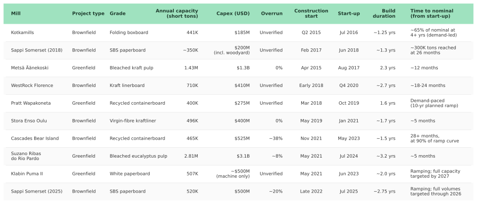
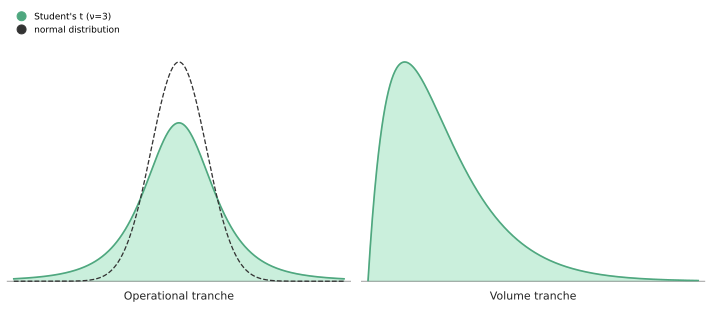
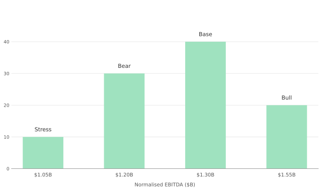

The four scenarios that closed out the bull case for Graphic Packaging (NYSE:GPK) were, admittedly, tilted towards my own favourable outlook. Most bullish write-ups would choose to end there, but a thesis is worth more when it withstands probability than when it avoids it. All predictions are uncertain, but the better ones are weighted against base rates and bend when the facts do.
 

===

### The Discipline of Subjectivity

The [earlier write-up](https://gregorykelleher.com/graphic_packaging_behind_the_box) argued in prose, but now the job is to formalise my prediction and ask how plausible it really is once the reasoning has to commit to a number.

It's worth acknowledging first though, that just formalising a hypothesis doesn't make it objective. My view on GPK is _subjective_, strung together from partial information amidst a haze of uncertainty. This isn't so much a flaw on the part of my thesis, but rather the nature of probability itself. Probability is an expression of our lack of knowledge about the world, a statement of our ignorance and our best guess at an unseen truth.

That's what makes predictions uncomfortable. Pre-committing to a hypothesis forces us to state explicitly what we do not know, and then be held accountable to it. But accountability is what separates a subjective probability from an arbitrary one. A guess can still be disciplined, tethered to evidence, shaped by base rates and willing to move when the facts turn. Subjective doesn't mean arbitrary, it means reasoned.

This reasoned best guess is known, in Bayesian terms, as a _'prior'_, the probability assigned to a hypothesis before any new evidence is weighed. Worth noting too is that it's perfectly reasonable for an individual's prior to differ considerably from other rational peers, given the same set of facts. A prior is a reflection on how an individual interprets the evidence from their particular standpoint.

However, a prior is just the starting point. What matters more is _how_ it moves, and Bayes' Theorem is the rule that governs that movement. When new evidence appears, the prior is revised and re-shaped into a _'posterior'_ by a fixed proportion, set by how likely that evidence was under the hypothesis. The implication that follows is that two priors can start very far apart, and given enough evidence will tend, under broad conditions, to converge on the same posterior.

I prefer to see Bayes as a heuristic rather than a formula, a standard of reasoning whereby the extent to which an individual obeys it is the degree by which they're deciding rationally under uncertainty. The convergence property of inferential probability follows from the same logic, in that reasoned disagreement, given enough shared evidence, eventually resolves in the data.

That quiet convergence is the bet I'm making on my own reasoning, that if the prior is honest and the updates disciplined, the conclusion will be too.

### A Compass, Not a Crystal Ball

Before pressing on, the pushback from an imagined fundamental investor is easy to anticipate. The sniff of 'quantification' about formalising a conviction, not to mention revising beliefs with a mathematical formula, is antithetical to their dogma.

The objection comes from a long tradition. Graham and Buffett built a school of thought, modelled on sound judgement, temperament and narrative, with numbers solely reserved for determining a margin-of-safety, rather than for the probability of an outcome.

The charge against quantification is that numbers can be bent to flatter the analyst. Fairly answered, narrative does the same, only more subtly. A narrative thesis masks its confidence under the guise of prose, instructing us on what the investor believes, and often how emphatically, but not with what precision, and rarely what would change their mind.

My counter-argument is that probability addresses all three of these gaps explicitly. Bayes' Theorem compels us to name our belief, commit to how strongly we hold to it, and state in advance the size of the evidence that would shift it. The framework treats the view as something available to be wrong, in a form prose rarely admits.

What the narrative tradition treats as conviction is often an inability to state _how_ much a given piece of disconfirming evidence should weaken a view, whereas Bayes forces this question upon us in advance, before the evidence has arrived and can be wormed away.

None of this is a claim to false precision. Buffett's preference for being _"approximately right rather than precisely wrong"_ is usually read as a case against quantification, and by that measure, assigning a probability to a thesis sounds exactly like the precision he warns against. But the logic runs in both directions. A narrative thesis that refuses to express its confidence isn't really "approximately right" either; unfalsifiable vagueness is its own form of being precisely wrong. A prior is the approximation made honest, a ballpark figure crude enough to be revised but explicit enough to be held accountable.

Neither should a prior be confused with a forecast; it's merely our best assumption of the truth, given the evidence we have. Rather than being a crystal ball, Bayes is akin to a commitment device that gives us a way of stating in advance how _much_ a given piece of evidence should move a view, which repudiates the temptation to revise a view retroactively without admission.

As a contrarian on GPK, this discipline matters more than usual. My earlier write-up on GPK argued that the market had priced the stock down through a cascade of recency bias, availability cascades, authority-misinfluence and loss aversion, all feeding each other until the narrative overwhelmed the numbers. The cascade is symmetrical, and if it runs in reverse, the narrative it overwhelms this time will be mine.

The difficulty sharpens precisely when the evidence seems to cooperate. The moment a contrarian view on GPK begins to look validated, by a clean Waco cadence, a better-than-feared earnings report, a softening in sell-side tone, is the moment confirmation bias silently seeps in, recasting each favourable data point as vindication rather than weighing it for what it actually implies.

Stating a prior in advance is pre-commitment against that drift. I'm thereby consciously denying my future self the ability to retroactively inflate my own conviction, or to justify that my view was always held at the strength any later evidence appears to warrant. The academic Baruch Fischhoff named this 'creeping determinism'; the past being rewritten as preordained once the outcome is known. The deeper argument I'm trying to conclude on here isn't exclusively against the narrative tradition, but rather to state that conviction left unaudited is conviction that cannot be updated.

### Anchoring before Believing

So that leads us to the question then, how do you go about auditing a conviction? A naïve approach might be to simply re-state the original bull thesis as a percentage. However, a prior pulled from conviction alone is committing the exact same sin the previous section warned against. If I did that, I'd only be informing the reader on what I believe, decorated with a number, but anchored to nothing beyond my own narrative. A prior only earns its weight when it's tethered to something outside the thesis itself; a reference class, a precedent whose outcome is already known, and whose resemblance to the present case can be judged upon its merits.

The four scenarios I outlined in the previous post might suggest that the thesis depends on several factors at once, e.g. EBITDA, leverage, the multiple, the terminal price. This looks like a lot of moving parts, but it's possible to collapse it down into a single latent variable, the one from which everything else follows mechanically.

That variable being normalised EBITDA. Where it settles, determines the pace of deleveraging, which determines when leverage crosses the threshold at which equities historically re-rate, which in turn determines the terminal equity value. Management's normalised guidance places EBITDA in roughly the $1.20B-$1.40B band, while the four scenarios from the [earlier write-up](https://gregorykelleher.com/graphic_packaging_behind_the_box) bracketed the variable more widely between $1.05B and $1.55B. The largest company-specific input to that figure is whether the Waco mill delivers on its guided cost displacement.

There are two competing hypotheses on that question, and they're not equally anchored.

The first has a direct precedent with a known outcome. Waco is nearly identical to GPK's K2 factory at Kalamazoo, built by the same team, running the same technology, and already tracking ahead on every disclosed metric. K2 delivered $130M of incremental EBITDA at full run-rate, exceeded its capacity targets, reached design capacity in six months, and hit full commercial output within twelve. The simplest prediction is that Waco does roughly the same.

The second hypothesis, that Waco fails to deliver, doesn't quite have an equivalent precedent to argue from. It can't point to a comparable factory, built by the same team, tracking ahead on the same metrics, where cost displacement then failed to materialise. That doesn't render the bear case impossible per se, but it does mean it's arguing _against_ a reference class rather than from one.

Close to $100M of Waco's $160M target was framed by former CEO Doss as cost displacement, and that piece is the hardest to dispute. The Middletown and East Angus factories have already been shut, their production costs are now a matter of record, and Waco produces the same product at a lower cost-per-ton. The gap exists in the physical cost structure of the asset already, before any forecast comes into it. New CEO Rietbroek has neither reaffirmed nor retracted the $160M target, but the cost-displacement piece doesn't need him to; it rests on closures that already happened.

The remaining $60M is in a different category entirely. Doss conditioned it on a 2027-28 demand recovery, and on that question management has gone silent. The closest that comes to crediting Waco at all is a "Net Performance" bucket of $40-110M in the March 2026 investor slide deck, in which a footnote concedes _"includes benefits from Waco"_ alongside weather offsets without specifying whether those benefits are cost-displacement, volume, or both.

!!! The $160M Waco target gets cut two different ways across management's earnings calls, and it's easy to mix them up. The _structural_ split, which is what actually generates the EBITDA, is ~$100M from cost displacement (the closed mills) and ~$60M from incremental volume sold through Waco. The _temporal_ split, which is when it shows up in reported results, is roughly $80M in 2026 and $80M in 2027, with Doss framing the second $80M as contingent on a 2027-28 demand recovery rather than as a guaranteed lag. The analysis here uses the structural split, since the cost question and the volume question hinge on different evidence and need to be calibrated separately.

K2 ramped into a boom year; Waco is ramping into a CPG environment where volumes have stabilised but not yet recovered, and where excess SBS capacity continues to pressure packaging pricing at the margin. The ramp may be ahead of schedule, but the demand needed to absorb the extra tons isn't yet visible in the data. That gap is most acute on the volume question, where no reference class will close it; only quarterly demand data will. It also touches cost displacement, because lower-cost tons only book as savings once they sell. If they pile up as unsold inventory instead, the cost advantage is real in the asset but doesn't show up in reported EBITDA until those tons clear.
 
Even so, the K2 anchor still earns its keep on the cost ramp itself. K2's outcome is known, so it bounds what Waco should deliver at the asset, and the next few quarters of filings will either confirm or contradict that bound.

Why K2 rather than a more skeptical anchor? The intuition parallels Occam's razor. Both hypotheses must explain the same set of facts, but it's only the bear case that introduces a new mechanism, unobserved so far, by which a near-identical mill, run by the same team, produces a materially different result. By contrast, the bull case requires no such mechanism, which is why K2 is the parsimonious anchor. The absence of a counter-mechanism is evidence, not proof, in favour of that reading; if one surfaces, the anchor moves with it.

K2 is the right anchor, but anchoring is not the same as calibrating. The next question is whether K2's outcome is typical of large-mill builds or an outlier, and that's the question the rest of the distribution has to answer.

### Calibrating the Prior

Of the inputs that move normalised EBITDA across the $1.05B-$1.55B range, Waco's $160M target is the largest, and its evidence base is the only one rich enough to calibrate probabilistically. Base-business volumes, SBS pricing, incentive compensation restoration, and tariff and energy drift all matter in aggregate, but each sits inside the four scenarios from the earlier write-up rather than warranting separate calibration. Where Waco lands sets the weights on those four scenarios.

The $160M itself splits into ~$100M of cost displacement and ~$60M of incremental volume, each leaning on very different evidence. Of the two, the cost piece is where K2 has the most to say.

#### The Operational Tranche

If K2 were the only large-scale mill ramp-up on record, the operational forecast would rest on a sample of one. But over the past decade, there have been enough comparable mills built to assemble a base rate, and that's what tunes a single precedent into something defensible.

!!! K2 is deliberately excluded from the comparator set above. Including it would make the table self-referential, since the same observation cannot anchor the operational forecast and also serve as one of the data points calibrating it, and the shared operator, OEM, and team that connect K2 to Waco introduce common-cause confounding that the wider base rate is meant to control for. K2 is examined separately below as the inside-view anchor.

The above examples were chosen on three criteria: scale (greenfield or major single-machine rebuild), post-2015 vintage, and publicly disclosed capex. Failed or cancelled mill projects have been omitted, which naturally tilts the set towards survivors. Admittedly the table is also crude by design; it cannot capture the finer minutiae of any single build, but it's enough to read the shape of the distribution.

Looking over the selection of ten builds, five disclose verified overrun figures. Two came in on budget (Metsä, Stora Enso Oulu), one ran ~8% over (Suzano), one ran ~20% over (Sappi 2025), and one ran ~38% over and is still ramping more than two years post-startup (Bear Island). Construction durations cluster around 1.5-2 years for single-machine brownfield projects, stretching past 3 years for the largest integrated pulp-and-paper greenfields. Excluding the two demand-paced builds (Kotkamills, Pratt), the remaining eight ramps split roughly evenly; three reach nominal within twelve months (Stora Enso Oulu, Suzano, Metsä), four extend past two years or are still ramping (Sappi 2018, Bear Island, Sappi 2025, Klabin), and only WestRock sits in the 12-24 month middle.

Stripped of any specific knowledge of Waco, the distribution is bimodal between fast (under 12 months) and extended (24+ months) ramps, with a Bear Island-style failure rare but possible. With n=10, the credible interval is indeed wide, and the survivorship bias in the comparator set tilts the forecast optimistically. The deeper hazard is what Tversky and Kahneman called the 'Law of Small Numbers', the human tendency to read a sample of ten as more representative of large-mill outcomes than the underlying variability warrants. Both named biases pull in the same direction, shifting the central estimate toward 18-24 months to nominal, with meaningful probability on either tail.

Examined separately as the inside-view anchor, K2 sits at the upper end of that distribution. It reached design capacity in roughly six months and exceeded its design specification (550k short tons against an announced 500k), placing it among the fastest-ramp comparators in the table. That's a meaningful signal given the shared operator, OEM, and team, but representativeness bias cuts both ways. Waco is a larger machine ramping into a weaker demand environment, and a sample size of one is still a sample size of one. K2 nudges the central estimate back toward the fast end of the 18-24 month range, but a single inside-view data point cannot collapse the outside-view distribution onto itself.

So what might push Waco toward the Bear Island end of the distribution? The candidates are grade execution risk (CUK at this scale is new for the team), demand timing (a soft consumer packaging market would slow commercial ramp), and machine scale (larger machines have historically had longer commissioning curves). None of these are visible problems today, but each is a Waco-specific risk the base rate cannot see, and any of them could push the actual outcome toward the slow tail of the already-widened distribution.

Early data, however, has already provided some fresh insights on Waco specifically. First commercial production came significantly earlier than planned. Start-up costs landed at $40M against a $60-75M budget, with zero expected in 2026. Management described the ramp as _"faster even than our highly successful K2"_. Management commentary on capex projects carries optimism bias, so I'd rather read the management quote as directionally supportive rather than as fact. The independently verifiable indicators (production date, startup costs in dollars, guided ramp window) are consistent with the management framing rather than reliant on it.

On the questions the base rate is equipped to address, Waco clears the threshold comfortably. It's ramping fast, it built on budget, and the early indicators track towards the upper tail of the distribution rather than the middle. The question the base rate cannot speak to is demand, which is the volume tranche the next sub-section turns to.

#### The Volume Tranche

Before pressing on, there's an intrinsic difference to highlight between the volume tranche and the operational one. The operational question itself splits into two layers. The unit cost gap (Waco's cost-per-ton against the closed Middletown and East Angus baseline) is epistemic, a fact already fixed in the asset that closed mills and the next few quarters of filings narrow the aperture on. The flow-through to reported EBITDA is partly aleatory, because lower-cost tons only book as savings once they sell. Quarterly evidence narrows the first layer, not the second.

The volume tranche, by contrast, is aleatory through and through. Whether the remaining ~$60M materialises depends on demand conditions outside GPK's remit; the answer hasn't yet been made, and no quantity of evidence can collapse it on its own, only time can.

Immediately reaching for the same comparator set logic here would just be choosing the wrong instrument. Base rates are built to interpolate an answer the world already holds, not to forecast one it hasn't yet produced. There's simply no honest reference class for 'incremental tons sold into a stalled CPG demand environment' that would be principled enough to use. The implication for Bayes, then, is that the volume forecast will not collapse on quarterly evidence the same way the operational one did, and hence must be held wider, for longer, and with less faith in narrowing.

A wider forecast is not the same as no forecast, and what's available to set it on is largely what management has and hasn't committed to. Former CEO Michael Doss's figure of ~$60M is the only number ever publicly attached to the volume piece, originally framed as conditional on a 2027-28 demand recovery. His successor, Rietbroek, has neither reaffirmed nor replaced that figure, but on the Q4 2025 call he conceded that current EBITDA is _"substantially lower than it was projected to be when the company first established its Vision 2030 financial targets, when volume growth was expected to be positive"_.

That admission, parsed honestly, appears to retract the demand-side assumption that Doss's number depended upon. On the same call, when CFO Lischer was asked about the 200K-ton inventory overhang and when it would clear, he could only add that the company _"would much prefer that come out via demand than via downtime, but we are committed to getting it out"_. Reading between the lines, the CFO is planning the year on the assumption that demand will not show up to absorb the surplus.

That stance isn't just confined to GPK. Outside of the company, the wider market has reached the same conclusion. Industry data through Q1 2026 shows paperboard mills running at reduced capacity, with production lower year-over-year, with producers drawing down their own inventories too. Box shipments (an analog for what consumer-goods companies are actually pulling through to retail) were also lower on the prior year. The broad pattern is that producers are curtailing output to work through stockpiles, rather than running flat-out to meet demand. All in, this puts Waco in the position of ramping into excess capacity, rather than into a shortage. To put it succinctly, what the data describes is an industry banking on a slower recovery than the one Doss's $60M was written against, and GPK's own 2026 plan reads the same way.

Some uncertainties aren't waiting for evidence; they're waiting for time, and the volume tranche is one of them. The operational story narrowed comfortably onto K2 and a known cost structure. This one cannot, because management, GPK's own 2026 plan, and the wider market are now positioned for less demand than what the $60M ever assumed. Not every Bayesian update is a tightening, and the honest stance here is a wide forecast, biased low. The wise thing to do next is to use both tranches together to weight the prior on normalised EBITDA, the variable on which leverage, the multiple, and the terminal price all hinge.

### Committing to a Number

> _"The difference between being very smart and very foolish is often very small" ~ Amos Tversky_

The two tranches outlined above must now be translated into a single set of weights, concrete enough to amount to a probability claim. Stated in advance, the weights can be held accountable to whatever the next quarter brings. Stated afterwards, they aren't a prior at all, only a rationalisation. The whole point of the earlier warning against creeping determinism was to force the commitment now, while the answer is still genuinely unknown, and while the weights can still be moved honestly by the data rather than retrofitted to it.

The work that follows is to draw an informed prior out of the two tranches, what the formal terminology would call _"elicitation"_. To visualise, each tranche contributes a different shape. The operational tranche can be pictured as a bell-shaped distribution, tightened by K2 and the comparator base rate around the cost-displacement target. On the other hand, the volume tranche would be right-skewed, with the bulk of the probability mass at the low end and a long tail trailing into upside.

Reconciling them into a single prior on normalised EBITDA is where proper discipline matters. As a reminder, a prior is at best an approximation by construction, which neatly aligns with George Box's famous line that _"all models are wrong but some are useful"_. The useful prior for us here, is the one whose shape roughly captures the structure the evidence actually supports, and stops there. The aim is to be accurate, but not necessarily precise, since precision can flatter a number with more confidence than the evidence might support, whereas accuracy admits to the width around it.

The first place that discipline gets tested is the instinct to formalise. I was initially inclined to render the two tranches as continuous distributions, fitting a Student's t-distribution to the operational tranche and a beta-distribution to the volume tranche, then convolving both into a single Waco distribution. This might've had the semblance of being statistically rigorous on paper, but underneath, it would've led to the same false precision the previous paragraph warned against.

Each tranche resists a smooth fit for different reasons. On the operational side, ten observations carry too much noise to produce a clean signal, so any continuous fit would risk overfitting to it. The sample is also heterogeneous, spanning multiple grades, operators and jurisdictions, so producing any single distribution would smooth that variation into a shape it hadn't yet earned. Likewise with regards to the volume tranche, I have to be honest and admit that there simply isn't enough valuable data to anchor a parametric distribution at all.

The four scenarios from the earlier write-up already provide a discrete distribution, at the resolution the evidence can credibly support, so any continuous form layered over them would be applying imprecise weights in better-looking math without refining the belief beneath. The real value here lies in the pre-commitment, the structured updating, and the accountability that follows from both, not in the form of the distribution itself.

Pinning the estimates then, the prior would read, out of 100 plausible futures, 10 land in stress at ~$1.05B, 30 in bear at ~$1.20B, 40 in base at ~$1.30B, and 20 in bull at ~$1.55B. Tabulated below:

| Scenario | Normalised EBITDA | Out of 100 | Joint tranche outcome                      |
|----------|-------------------|------------|--------------------------------------------|
| Stress   | $1.05B            | 10         | Bear Island operational tail, no volume    |
| Bear     | $1.20B            | 30         | Operational delivers, no volume            |
| Base     | $1.30B            | 40         | Operational delivers, partial volume       |
| Bull     | $1.55B            | 20         | Operational upper tail, full volume        |

The "out of 100 plausible futures" phrasing is a very deliberate one, and follows David Spiegelhalter's recommendation to prefer natural frequencies over percentages. Allocating whole futures avoids decimal probabilities that could tempt false precision and keeps the prior at a resolution the underlying evidence can actually carry.

Recognising that 60 out of 100 possible outcomes land at base or better is a tempered conviction for a thesis argued this hard, and more subdued than my preceding prose would suggest. This even comes as a surprise to me, but I admit that it also underscores the gap between a thesis argued in prose and the same thesis held to a number, which is exactly the gap I intended the framework to surface. The discomfort of leaving it there is what pre-committing to a number costs in practice.

### Bending with the Facts

A prior is only as Bayesian as the rule by which it is allowed to move. Outlining this 'Update Rule' in advance, before any new evidence arrives is the key tenet of the framework that lets the prior become a posterior. The work that remains is to state which streams of evidence move which weights, at what cadence, and by how much. The two streams that matter are not symmetric; the cost-displacement evidence at Waco accumulates quarterly toward an answer that already exists in the asset, while the demand evidence accumulates only as the world produces it, and may never converge inside the holding period at all. The cadence and magnitude of each rule has to reflect that asymmetry, since applying a single update mechanism across both would smooth the asymmetry away without removing it from the underlying problem.

Hence why I've settled on a single annual reweight at FY2026 close, into which both streams feed, and against which the four weights are reset rather than nudged. The cumulative year of evidence is read against the prior in one sitting, and whatever quarterly drift has accrued in the meantime is overwritten by that reading, not compounded with it. In between, the operational stream is allowed to move the prior quarterly, but only by small amounts and only on the narrow signals the next sub-section sets out. The volume stream is held mute until the demand picture turns decisively, since quarterly readings on demand are too noisy to honestly move a prior on.

The quarterly cadence is therefore narrow by design, catching only the surprises large enough to out-run ordinary noise, whilst the heavier work of reading a full year of evidence as a set is reserved for the annual reweight.

#### The Quarterly Guardrail

| Quarterly Operational Stream Signal        | Update                                       |
|--------------------------------------------|----------------------------------------------|
| Inside management's guidance band          | No change                                    |
| Outside band, either direction             | ±3pts shifted between bear and base/bull     |
| FY guidance raise or substantive walk-back | ±5pts shifted between bear and base/bull     |

The 'No change' default is the load-bearing rule of the three. Quarterly cost outcomes carry enough natural variance that an inside-band print says little about the run-rate, and a rule that nudged the weights every quarter would end up chasing that variance into whichever recent print happened to land closest. The ±3pt move is reserved for outside-band prints where the surprise has at least cleared ordinary noise, and the ±5pt response for the one event that resets the band centre itself, a formal guidance change.

#### Waiting on Demand

Quarterly demand readings are noisy by construction; any single soft or strong print sits well inside ordinary cyclical variance, and rarely says anything about whether the underlying demand regime has shifted. A rule that moved the prior on those readings would be updating on cycle noise it has already absorbed into the calibration. The volume stream therefore stays dormant on the quarterly cadence, and is reserved for the point at which the demand picture turns on evidence that survives a single quarter. The asymmetric magnitude when it does fire mirrors the calibration; the prior is already biased low on volume, so a downside surprise confirms a posture the weights already carry, whereas an upside surprise contradicts it directly and earns the larger shift.

| Volume Stream Signal                                                                       | Update                                               |
|--------------------------------------------------------------------------------------------|------------------------------------------------------|
| Single-quarter print, either direction                                                     | No change                                            |
| Confirmed demand shift across box shipments, paperboard volumes, and management commentary | +5pts on upside / -2pts on downside (asymmetric)     |

#### The Annual Reweight

At FY2026 close, the four weights can be revisited as a set. The data entering the reweight is a full year of evidence read together. The annual reweight is the only point in the rule where the prior is able to move on the strength of that cumulative evidence, and the magnitudes reflect both that weight and the fact that one year is still a single annual observation.

| Annual Reweight Signal                                                                     | Update                                               |
|--------------------------------------------------------------------------------------------|------------------------------------------------------|
| Operational tranche outcome (Waco above or below band, persistent)                         | ±10 to 20pts shifted between bear and base/bull      |
| Confirmed demand shift across box shipments, paperboard volumes, and management commentary | ±2 to 5pts shifted between bear and base/bull        |

Again, I've intentionally skewed the scoring towards the operational tranche. This is because any operational tranche miss would damage K2 directly as an inside-view anchor. The entire operational tranche argument rested on the claim that Waco would track K2 within reasonable bounds, and a sustained departure would indicate that K2 was less representative than the calibration assumed, or Waco has encountered issues the base rate sampling hadn't envisioned. Either reading takes a load-bearing piece out of the prior, and the magnitude must be commensurate.

On the other hand, the volume tranche outcome is a smaller adjustment in either direction because the prior has already priced a wide range on volume; the calibration deliberately held the volume forecast wide and biased low, so neither a soft year nor a slightly better one moves the weights far.

#### Drawing the Line

The update rules govern how the prior bends, but the harder question is in deciding when it should break. Without that stopping condition, the framework is recursion missing its base case; each update calls the next, and the prior never returns from the stack. There's a structural limitation in the cadence worth flagging too. Convergence also depends on enough evidence to overwhelm the prior, and four quarterly prints plus one annual reweight, against a target that phases in over 2026-27, is too thin to lean on. The prior may have to be carried on evidence that never quite converges.

Hence why three falsifying conditions are worth pre-committing to alongside the update rule itself.

First, asset-level cost evidence at Waco that breaks from K2 in absolute level. If Waco's mature cost-per-ton settles materially above the closed Middletown and East Angus baseline, the ~$100M of cost displacement isn't there at all, however neatly the ramp curve might run. That cost gap was the structural certainty the whole thesis rested on, and its absence retires the bull case outright.

Second, a sustained demand outcome at either extreme. A genuine 2027 recovery would invalidate the held-low volume forecast well beyond what the +5pt update can absorb; a multi-year deterioration that takes industry box shipments below the four scenarios' floor would invalidate the whole set together, since no redistribution among them would recover it.

Third, a strategic pivot that breaks the integrated CPG composition the thesis rests on; a divestment of a core segment, or a covenant-permitted acquisition outside the cartonboard franchise that materially changes the asset mix. The credit amendment's leverage ceiling and active buyback authorisation already rule out dilution and capital reallocation as falsification triggers, so asset composition is the one structural surface left. A change there leaves the K2-Waco operating thesis pointing at the wrong company, and the prior has to be retired outright.

I don't expect any of these to fire. Whilst that's the case, the act of naming them now, with the evidence still looking cooperative, is what gives them weight once it stops.

### From Prior to Position

The framework operates entirely in EBITDA terms. Translating the prior into per-share value is a separate exercise that shows what it implies for the share price. The resulting figure carries no claim to precision; the weights are committed in whole units out of 100, the scenarios round normalised EBITDA to the nearest $50M, and the terminal prices were already rounded coming out of the [earlier write-up](https://gregorykelleher.com/graphic_packaging_behind_the_box).

Those terminal prices derive from the deleveraging arithmetic and the EV/EBITDA multiple expanding alongside it. Applying the weights to them produces a per-share figure:

| Scenario | Normalised EBITDA | Terminal price | Weight | Contribution |
|----------|-------------------|----------------|--------|--------------|
| Stress   | $1.05B            | $4.29          | 10/100 | $0.43        |
| Bear     | $1.20B            | $9.77          | 30/100 | $2.93        |
| Base     | $1.30B            | $16.52         | 40/100 | $6.61        |
| Bull     | $1.55B            | $26.08         | 20/100 | $5.22        |

The contributions sum to a probability-weighted value of $15.19. Against the current $9.24 quote, that implies roughly 64% upside. Putting the conviction in one number forces every component to be auditable; if the evidence shifts, the weights or the prices move and the $15.19 moves with them.

The contribution column is where the shape of the bet actually sits. The bull tail alone contributes $5.22, against $3.36 from the stress and bear combined. The earlier write-up argued the payoff was asymmetric; here that asymmetry shows up in the arithmetic, with the right tail doing the heavy lifting and the left tail capped well above zero.

$15.19 is a summary, however, and a summary is not a confidence measure. Outcomes span $4.29 to $26.08, so the spread is wide, and the 10/100 stress contribution is the honest reminder that the floor carries a real loss.

### Carrying the Prior

The piece opened with the claim that a thesis is worth more when it withstands probability than when it avoids it. The audit suggests the thesis did withstand the test, but came out of it less emphatic than it went in. 60 out of 100 futures landing at base case or better still leaves 40 falling short of it, which is a more measured reading than the bullish prose had implied before the weights were attached. Naming that gap is what the framework requires.

Therein lies the point of the exercise. The work was never going to converge on a single price the reader could lift and act on, because the gap between a thesis argued in prose and the same thesis held to a number is precisely the thing worth surfacing. The prior is the audit; the audit is the deliverable. Walking away with $15.19 in mind and forgetting the procedure that produced it is a way of inheriting the answer without inheriting the discipline that made it answerable.

Most of the analytical work is already done; what's left is the part that has to be carried rather than computed. What still has to be carried is patience under the update rule, and alongside that, the willingness to retire the prior the moment a falsifier fires, rather than the moment retiring it becomes psychologically affordable. Pre-commitment is worth only what gets honoured once the evidence stops, or once it begins to cooperate.

Retiring a prior when the evidence cooperates is the harder half. The earlier worry was a cognitive cascade pricing GPK down, the bearish reading reinforcing itself in repetition. Cascades, however, run in both directions. A stretch of cooperative quarters could prime the same machinery in reverse, inviting upward revisions of the bull and base weights, downward revisions of the floor, and the comfortable sense that the framework has been validated rather than tested. That drift, if it happens without explicit accounting, is the framework failing while nothing announces the failure. The falsifier firing is the easy case; the falsifier never firing while the weights move quietly to flatter the holder is the case that matters.

What doesn't drift so easily is the shape of the bet itself; a right tail doing the heavy lifting, a left tail still carrying a real loss but kept above zero by the deleveraging maths at the $1.05B EBITDA floor, and a base case sitting well above today's price. The figure is downstream of that shape, and the shape is what the prior was being constructed to argue for from the start.

Bayes operated here as a heuristic. The prior is a posture under uncertainty. What the exercise was for, in the end, was the practice of holding the prior, carrying it forward, and retiring it when it fails.

