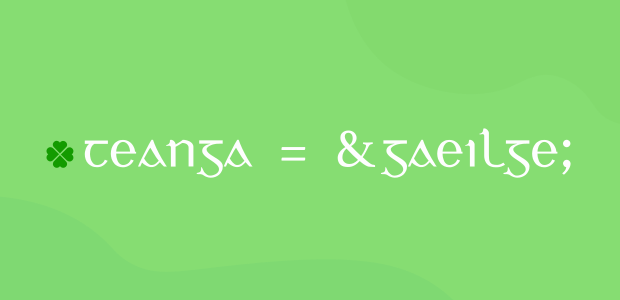

This might appear a little left-field, but it's always surprised me how the morphology of the Irish language lends itself to programming constructs.



===

!!! _Before I continue, I should point out the inspiration for this post originated with Michal Měchura's excellent article [here](http://www.lexiconista.com/awesome-irish/) which touches on the same thoughts_

### The grammatical quirks of Irish

Irish or Gaeilge is an insular Celtic language spoken in, well, Ireland. From a grammatical perspective, it has some unusual traits that set it apart from other modern Indo-European languages: inflected prepositions, initial consonant mutations, and verb-subject-object word ordering.

While these linguistic aspects can be difficult for language learners, they have certain analogies with programming.

### The Copula - _An Chopail_

Irish has two verbs that correspond to the English "_to be_". One of which is called "_the copula_" or **is**.

!!! _A copula is defined as a word that connects a subject and predicate in a relationship of equivalence, i.e. copulates_

The copula is primarily used to describe identity or quality in a _permanent_ sense. Depending on its usage, it's either termed a _classifying_ copula or _identifying_ copula.

#### Classification

The _classifying copula_ construction is used to express a "class membership" relation in Irish.

| Irish | English |
| ------ | ----------- |
| Is dochtúir é | _He is a doctor_ |
| Is múinteoir í | _She is a teacher_ |

```cpp
struct Múinteoir {};

int main()
{
    // classification: "í" (subject) belongs to class "múinteoir" (predicate)
    // i.e. "í" is an instance of the class "múinteoir"
    Múinteoir í;
}
```

#### Identification

The _identifying copula_ construction is used to express a shared _identity_ between the subject and predicate.

| Irish | English |
| ------ | ----------- |
| Is é an dochtúir é | _He is the doctor_ |
| Is í an múinteoir an bhean | _The woman is the teacher_ |

```cpp
struct Identity {};

int main()
{
    // "í" identity object
    Identity í;

    // identification: "an_múinteoir" (predicate) and "an_bhean" (subject) refer to same identity
    // i.e. both variables point to the same "í" object
    Identity *an_múinteoir = &í, *an_bhean = &í;
}
```

### Word ordering - _Ord na bhfocal_

Irish follows a verb-subject-object (VSO) word ordering:

| Verb | Subject | Object | English |
| ------ | ----------- | --- | ---  |
| Múineann | sí | Gaeilge | _She teaches Irish_ |

This word arrangement maps naturally to a function call:

```cpp
struct Múinteoir {};

// verb(subject, object)
void múineann(Múinteoir múinteoir, std::string teanga) {};

int main()
{
    Múinteoir í;

    // "múineann" (verb) "(s)í" (subject) "gaeilge" (object)
    // word order preserved
    múineann(í, "gaeilge");
}
```

So not only does Irish satisfy the _syntax_ of the programming language, it's also _semantically_ and (almost) _grammatically_ correct. Pretty cool.

! To use the correct grammar, it should be _"múineann **sí** gaeilge"_ using the subject form of the pronoun, **sí**, rather than the copula form **í** introduced earlier

! Literally translating _"múineann sí Gaeilge"_ would be _"teaches she Irish"_

Irish isn't the only VSO language; Welsh, Arabic, and Classical Hebrew all share this ordering and would produce the same mapping. But Irish has a trick that takes it a step further: _synthetic verb forms_.

In certain tenses, the subject pronoun fuses into the verb ending itself. _"Múineann mé"_ (I teach) becomes _"múinim"_, where the _-im_ suffix encodes the subject. The subject is no longer a separate argument; it's bound into the verb.

That's closer to method dispatch than a free function call:

```cpp
struct Mé {
    // synthetic: "múinim" - subject fused into the verb
    // like a method where the actor is implicit (this)
    void múinim(std::string teanga) {};
};

int main()
{
    Mé mé;

    // analytic:  múineann(mé, "gaeilge") - free function, explicit subject
    // synthetic: mé.múinim("gaeilge")    - method call, subject is bound
    mé.múinim("gaeilge");
}
```

### Initial mutations - _Na n-Athruithe Tosaithe_

Irish has a feature that looks bizarre to learners. It's the fact that the first letter of a word can change depending on what comes before it. These _initial mutations_ come in two forms: _séimhiú_ (lenition) and _urú_ (eclipsis).

Séimhiú inserts an 'h' after the initial consonant. Urú prepends a new consonant that "eclipses" the original. Both are deterministic, where the preceding grammatical context dictates which transformation applies.

| Trigger | Base | Result | Type |
| --- | --- | --- | --- |
| mo (my) | bean | mo **bh**ean | séimhiú |
| mo (my) | cáca | mo **ch**áca | séimhiú |
| ár (our) | bean | ár **mb**ean | urú |
| ár (our) | cáca | ár **gc**áca | urú |

The word's identity doesn't change; only its surface form does. That's a direct analogy to higher-order functions or decorators; a grammatical context wraps a word and transforms its appearance without altering what it refers to.

```cpp
std::string séimhiú(std::string focal) {
    // lenition: insert 'h' after the initial consonant
    focal.insert(1, "h");
    return focal;
}

std::string urú(std::string focal) {
    // eclipsis: prepend a consonant that overshadows the original
    static std::map<char, std::string> eclipse = {
        {'b',"m"}, {'c',"g"}, {'d',"n"}, {'f',"bh"},
        {'g',"n"}, {'p',"b"}, {'t',"d"}
    };
    if (eclipse.count(focal[0])) focal.insert(0, eclipse[focal[0]]);
    return focal;
}

// "mo" always triggers séimhiú - the context determines the transformation
auto mo(std::string focal) { return séimhiú(focal); }

// "ár" always triggers urú
auto ár(std::string focal) { return urú(focal); }

int main()
{
    // mo + bean → mo bhean (my wife)
    // ár + bean → ár mbean (our wife)
    auto bhean = mo("bean");
    auto mbean = ár("bean");
}
```

The trigger rules (after _mo_, _do_, _a_ (masculine possessive), etc.) are essentially pattern-matching on the preceding token; each context dispatches to a specific transformation.

### Prepositional pronouns - _Forainmneacha réamhfhoclacha_

Prepositions are words such as "with", "for", "at" or "on". Unlike many other languages, these words can be inflected in Irish.

A word like "on" translates to **ar**. And **ar** combines with personal pronouns to produce _inflected forms_:

| Pronoun | On |
| --- | --- | 
| me | orm | 
| you | ort | 
| he | air | 
| she | uirthi | 
| us | orainn | 
| ye | oraibh | 
| them | orthu | 

This inflection isn't arbitrary; it's a rule-governed morphological transformation. The forms follow patterns, and the inflection table is better understood as a _pure function_ than a flat enumeration:

```cpp
std::string ar(std::string pronoun) {
    // inflection as function: preposition + pronoun → inflected form
    // the transformation is productive, not an arbitrary lookup
    static std::map<std::string, std::string> forms = {
        {"mé", "orm"}, {"tú", "ort"}, {"sé", "air"},
        {"sí", "uirthi"}, {"muid", "orainn"},
        {"sibh", "oraibh"}, {"siad", "orthu"}
    };
    return forms[pronoun];
}

int main()
{
    // "cuir" (verb) "agallamh" (object) "air" (inflected pronoun)
    // "put interview on-him" → "interview him"
    auto inflected = ar("sé");  // → "air"
}
```

As Michal Měchura pointed out in his article, Irish is strongly _periphrastic_. In other words, Irish places greater emphasis on multi-word constructions to convey meaning rather than using single verbs.

This is apparent in _"cuir agallamh air"_ which literally translates to _"put interview on-him"_. Or in proper English, _"interview him"_ in the imperative sense.

### The verbal noun - _An Ainm Briathartha_

Irish uses the _verbal noun_ for progressive aspect rather than conjugated verb forms. Where English says _"she is teaching"_, Irish says:

| Irish | Literal | English |
| --- | --- | --- |
| Tá sí ag múineadh | She is at teaching | _She is teaching_ |

The verbal noun _múineadh_ (teaching) is a reified action, i.e. a noun derived from a verb. It isn't invoked directly; it's passed around with prepositions like _ag_ (at). The action is a _value_ being operated on, not a direct call.

That's closer to first-class functions than anything in the conjugated verb examples:

```cpp
// the verbal noun: an action reified as a value
auto múineadh = [](std::string teanga) { /* teach */ };

// "ag" receives the action as a value - progressive aspect
template<typename F>
void tá_ag(std::string subject, F verbal_noun) {
    // the subject is "at" the action - it's ongoing
    verbal_noun("gaeilge");
}

int main()
{
    // "tá sí ag múineadh" - the verbal noun is first-class
    // the action is passed to "ag", not called directly
    tá_ag("sí", múineadh);
}
```

### The autonomous form - _An Fhoirm Shaor_

The autonomous verb drops the subject entirely. No actor is named:

| Active | Autonomous |
| --- | --- |
| Múineann sí Gaeilge (_She teaches Irish_) | Múintear Gaeilge (_Irish is taught_) |

The verb _múintear_ carries no agent. The operation is described without naming who performs it. In functional programming terms, that's _point-free_ style: defining a computation without explicitly binding its arguments.

```cpp
// active: subject explicitly present
void múineann(std::string subject, std::string object) { /* ... */ };

// autonomous: the subject is erased from the interface
// the operation is described without naming the actor
void múintear(std::string object) { /* ... */ };

int main()
{
    // active: "múineann sí gaeilge" - subject bound
    múineann("sí", "gaeilge");

    // autonomous: "múintear gaeilge" - point-free, no actor
    múintear("gaeilge");
}
```

### The genitive case - _An Tuiseal Ginideach_

Irish uses the genitive case to express possession. Where English puts the possessor first (_"the teacher's book"_), Irish reverses the order and inflects the possessor:

| Irish | Literal | English |
| --- | --- | --- |
| Leabhar an mhúinteora | Book of-the teacher(gen.) | _The teacher's book_ |

The owned object comes first. The owner follows as a qualified accessor, inflected into the genitive case (_múinteoir_ → _mhúinteora_). Structurally, it's the same nesting relationship as member access in most programming languages:

```cpp
struct Múinteoir {
    std::string leabhar = "Úrscéal";
};

int main()
{
    Múinteoir an_múinteoir;

    // C++ reads owner-first:  an_múinteoir.leabhar
    // Irish reads owned-first: leabhar an mhúinteora
    // reversed surface order, same structural nesting
    auto leabhar = an_múinteoir.leabhar;
}
```

Irish genitive ordering is the reverse of English possessive, but mirrors the qualified access pattern most programming languages use: the relationship is expressed through nesting, regardless of which direction you read it.

### Conclusion - _An Deireadh_

What started as a surface-level observation about word ordering turns out to run deeper. Irish distinguishes classification from identification at the grammatical level; so do type systems. Its synthetic verb forms bind the subject into the verb; so does method dispatch. Initial mutations are context-triggered pure transformations; so are higher-order functions. The verbal noun reifies actions as values; so do first-class functions. The autonomous form erases the actor; so does point-free style.

Irish is often treated as archaic or impractical. But its grammatical machinery, the mutations, the verbal nouns, the autonomous form, encodes distinctions that mainstream programming languages took decades to formalise. Both systems solve the same fundamental problem; how to express who does what to whom, unambiguously, in a structured form. Natural languages had a few thousand years' head start. It's not surprising they arrived at some of the same answers.